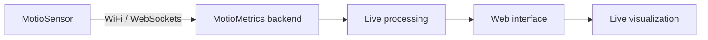
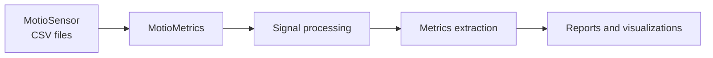
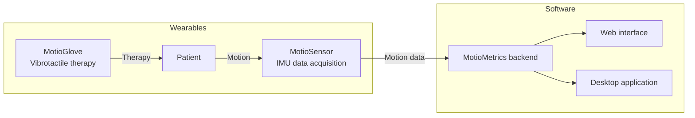

# 🧠 MOTIO — Biomedical Instrumentation Project

**MOTIO** is an end-to-end **biomedical instrumentation system** designed for the **analysis and treatment support of Parkinson’s Disease**, providing a **non-invasive, portable, and objective** approach to motor symptom monitoring.

The project integrates **wearable hardware**, **embedded firmware**, and an **intelligent analysis platform**, enabling both clinical and ambulatory use.

> 🩺 *Making motion science accessible.*

---

## 🎯 Project Objective

The main goal of MOTIO is to develop and validate a system capable of:

- 🧤 Delivering **vibrotactile therapeutic stimulation**
- 📟 Objectively measuring motor symptoms, especially tremor
- 📊 Processing and visualizing motion data through a clinical interface
- 📈 Complementing (not replacing) traditional clinical assessments (e.g. MDS-UPDRS)

---

## 🧩 System Architecture Overview

### 📁 Repository Structure

- 🧤 **MotioGlove/** — Wearable vibrotactile therapeutic device  
- 📟 **MotioSensor/** — Portable inertial measurement device (IMU)  
- 📊 **MotioMetrics/** — Motion analysis and visualization platform  

Each module can operate independently, but together they form a **complete ecosystem** for treatment, measurement, and analysis.

---

## 🧤 MotioGlove — Vibrotactile Therapeutic Glove

Wearable glove designed to apply **Vibrotactile Coordinated Reset (vCR)** stimulation to the fingertips.

### 🔬 Scientific Background
Based on research by **Tass et al. (Stanford University)**, vCR aims to **desynchronize pathological neural networks** using controlled mechanical stimulation.

### ⚙️ Key Features
- Vibrotactile stimulation at **250 Hz**
- Alternating stimulation of **finger pairs**
- Randomized stimulation sequences (**Fisher–Yates algorithm**)
- Temporal pauses with **jitter**
- Autonomous **2-hour therapy sessions**
- Button-based control and LED feedback

### ✅ Advantages
- Non-invasive
- Portable
- Ambulatory use
- High patient comfort
- No reported side effects

---

## 📟 MotioSensor — Inertial Measurement Device

Portable sensing unit designed to objectively capture motion data with **clinical-grade precision**.

### 🧠 Measured Signals
- 3-axis acceleration
- 3-axis angular velocity
- Orientation estimation (Yaw, Pitch, Roll)

### 🔄 Operating Modes
- 🏥 **Clinical mode**: real-time WiFi transmission
- 🏠 **Ambulatory mode**: local storage on microSD card

### 📁 Output
- `.csv` files containing:
  - Raw sensor signals
  - Timestamped activity annotations

---

## 📊 MotioMetrics — Motion Analysis Platform

Software platform responsible for **data processing, analysis, and visualization**.

### 🧠 Backend (Python)
- CSV file ingestion
- Automatic signal processing
- Tremor episode detection
- Computation of:
  - Dominant frequency
  - RMS amplitude
  - Episode duration
- Spectral analysis (FFT + **Burg method**)

### 🖥️ Web Interface
- Clinical-oriented UI
- Manual CSV upload
- Interactive visualizations (Plotly.js)
- Patient data registration
- PDF report export
- Local measurement history

### 🔴 Real-Time Analysis
- **WebSocket-based** communication
- Live signal visualization
- Activity logging with timestamps
- Automatic download of recorded data at session end

---

## 🔁 System Workflow

### 🧪 Real-Time Analysis

### 📂 Offline CSV Analysis

## 🧪 Validation & Results

The system was evaluated on:
- Parkinson’s patients with tremor
- Parkinson’s patients without tremor (dyskinesia)
- Control subjects

Results demonstrated:
- Strong correlation with clinical evaluation
- Robust tremor episode detection
- High usability and acceptance by patients and clinicians

---

## 🛠️ Technologies Used

- **Python** (signal processing & backend)
- **Flask + Socket.IO**
- **JavaScript / HTML / CSS**
- **Plotly.js**
- **ESP8266 (Wemos D1 Mini)**
- **MPU6050 IMU**
- **Render + GitHub**

---

## 👩‍🔬 Team

Developed as part of  
**Biomedical Instrumentation II — ITBA**

**Group 1**
- Alexa Sessarego Aurich
- Jazmín Azul Fermani  
- Olivia Grosso  
---

## ⚠️ Disclaimer

This project was developed for **academic and research purposes only**.  
It is **not a certified medical device** for commercial clinical use.

## 🗂️ Module Interaction Diagram

